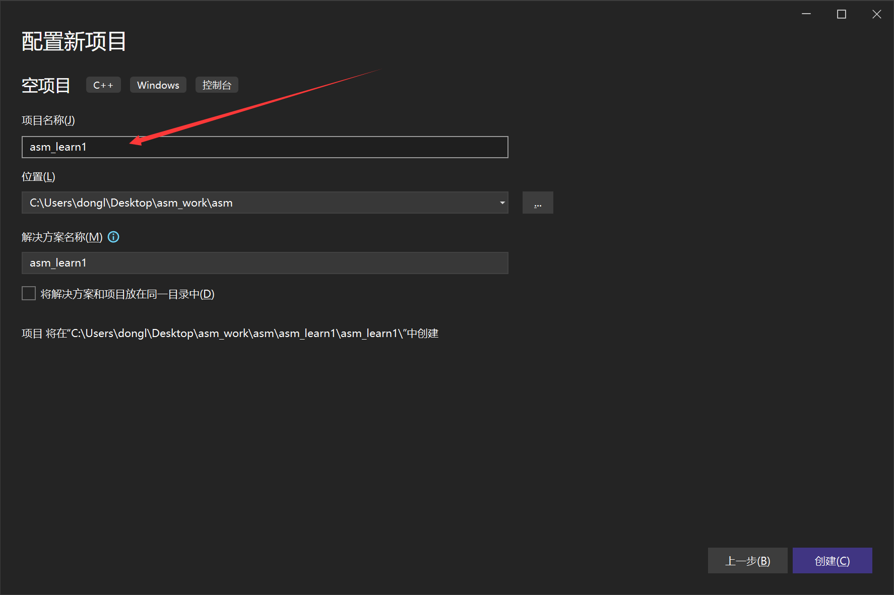

## ref

[VS2022 Win32汇编环境·Assembly · Hello World_vs2022win32下载-CSDN博客](https://blog.csdn.net/zhj12399/article/details/124844799)

## 创建项目





```
D:\masm32\lib
```


```
D:\masm32\include
```


## Run

### 控制台模式输出 Console

在`main.asm`添加如下代码

```asm
.386
.model flat,stdcall
option casemap:none;

includelib msvcrt.lib
printf PROTO C:ptr sbyte,:VARARG;

.DATA
szMsg byte "Hello World!",0ah,0;

.CODE
main:
    invoke printf,offset szMsg
    ret
end main

```

执行效果


### 窗口模式输出 Windows

更改`main.asm`的代码为

```asm
.386
.model flat, stdcall
option casemap:none
MessageBoxA PROTO :dword, :dword, :dword, :dword
MessageBox equ <MessageBoxA>
Includelib user32.lib

NULL equ 0
MB_OK equ 0
.stack 4096

.DATA
SzTitle byte 'Hi',0
SzMsg byte 'Hello World!',0

.CODE

main:
	invoke MessageBox,
		NULL, ;HWND hWnd
		offset SzMsg, ;LPCSTR lpText
		offset SzTitle, ;LPCSTR lpCaption
		MB_OK ;UINT uType
		ret
end main
```

改一下输出方式


执行结果

