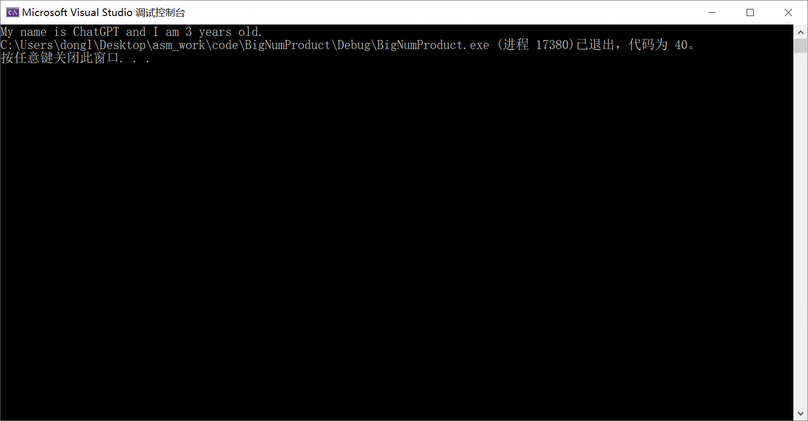

## 打印数据

这里学习利用汇编打印数据

首先需要知道的几点是

- 汇编程序如果想打印中文
  - 就必须得先把编码改成GB

下面是所有打印程序的所有代码及其注释

```asm
.386
; 设置目标处理器类型为 Intel 80386

.model flat,stdcall
; 设置内存模型为 flat（所有的代码和数据都在一个32位的线性地址空间中）和调用约定为 stdcall（被调用者清理堆栈）

option casemap:none;
; 设置汇编器不区分大小写

includelib msvcrt.lib
; 包含 msvcrt.lib 库，这是 Microsoft Visual C 运行时库，提供了许多 C 标准库函数

printf PROTO C:ptr sbyte,:VARARG;
; 声明 printf 函数原型，这是一个 C 函数，接受一个指向 sbyte 的指针和可变数量的参数

.DATA
; 开始数据段，用于声明和初始化静态数据

someMsg byte "测试打印",0ah,0;
; 声明一个名为 someMsg 的字节数组，包含字符串 "测试打印"，一个换行符（0ah）和一个 null 字符（0）

.CODE
; 开始代码段，用于包含程序的实际指令

main:
; 声明主程序入口点

    invoke printf, addr someMsg
    ; 调用 printf 函数，参数为 someMsg 的地址
    ; 这里的 addr 也可以写成 

    ret
    ; 返回调用者

end main
; 结束主程序
```

最终打印效果如下


简单分析

- 代码为9
- 意味着返回结果为9
- 这是因为`printf`的返回就是打印数据的长度
  - `"测试打印",0ah`一共占九个字节
  - 每个中文占两个字节
  - 换行占一个字节

### 简洁版本

我们也可以写成下面这样，这样就可以少写声明了

- 用到的C函数需要在前面加`crt_`

```asm
.386
.model flat,stdcall
option casemap:none
includelib msvcrt.lib
; for printf 
include msvcrt.inc
; prototypes for EXPORT msvcrt functions, add crt_ prefix

.DATA
    someMsg byte "测试打印",0ah,0

.CODE
    main:
        invoke crt_printf, addr someMsg
        ret
    end main
```

## 带格式的打印

```asm
.386
.model flat,stdcall
option casemap:none
includelib msvcrt.lib
include msvcrt.inc

.DATA
    formatStr byte "My name is %s and I am %d years old.", 0

    ; Strings for name and age
    myName byte "ChatGPT", 0
    myAge dword 3

.CODE
    main:
        ; Push arguments in reverse order (right to left) as required by cdecl calling convention
        push myAge
        push offset myName
        push offset formatStr

        ; Call printf
        call crt_printf

        ; Clean up the stack
        ; the stack pointer is incremented by 12 bytes (3 * 4 bytes)
        add esp, 12

        ret
    end main
```

- 这里我们根据函数调用约定是从右至左入栈
- 这里的`push`后面的`offset`
  - `myAge`前面之所以可以不加`offset`是因为我们可以把它当成一个立即数（四字节）来处理
  - 后面两个`myName`和`fotmatStr`是当成字符串来处理，所以我传地址（四字节的指针）
  - 都是四字节（32位是这样的）
  - 最后得手动释放空间
- 另外`offset`不可以用`addr`替换
- 参考[这里](https://blog.csdn.net/ypist/article/details/8130022)，说`addr`可以用在`invoke`语句中，但不能用在赋值的这种语句中，最后还建议说局部变量就使用`addr`，其它场合使用`offset`

### 简洁版本

方便以后复制粘贴用

```asm
.386
.model flat,stdcall
option casemap:none
includelib msvcrt.lib
include msvcrt.inc

.DATA
    formatStr byte "My name is %s and I am %d years old.", 0
    myName byte "ChatGPT", 0
    myAge dword 3

.CODE
    main:
        push myAge
        push offset myName
        push offset formatStr
        call crt_printf
        add esp, 12
        ret
    end main
```



## `0AH`和`0DH`

```asm
.386
.model flat,stdcall
option casemap:none
includelib msvcrt.lib
include msvcrt.inc

.DATA
    outputMsg   byte "The result is: %s", 0DH, 0AH, 0	
    result      byte "1234", 0

.CODE
    main:
        push offset result
        push offset outputMsg
        call crt_printf
        add esp, 8
        ret
    end main
```

在这段汇编代码中，`0DH` 是 ASCII 表中的一个字符，它代表回车（Carriage Return，CR）。在文本中，回车字符使光标返回当前行的开头。`0AH` 则代表换行（Line Feed，LF），它使光标移动到下一行。

在 Windows 系统中，文本文件的行结束通常由回车和换行两个字符组成（即 `0DH, 0AH` 或者说 CR+LF）。所以，`0DH, 0AH` 这个组合在这里的作用是在输出字符串后换行。

