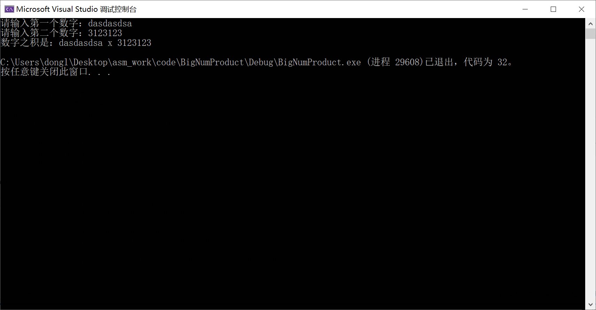

## 输入`%d`

```asm
.386
.model flat, stdcall
option casemap:none
includelib msvcrt.lib
include msvcrt.inc

.DATA
    inputMsg byte "请输入一个整数：", 0
    inputFmt byte "%d", 0
    outputMsg byte "你输入的整数是：%d", 0ah, 0

    buffer dword ?

.CODE
    main:
        ; 输出提示消息
        invoke crt_printf, addr inputMsg

        ; 输入整数
        invoke crt_scanf, addr inputFmt, addr buffer

        ; 输出输入的整数
        invoke crt_printf, addr outputMsg, buffer

        ret
    end main
```

### 简洁版本

```asm
.386
.model flat, stdcall
option casemap:none
includelib msvcrt.lib
include msvcrt.inc

.DATA
    inputMsg byte "请输入一个整数：", 0
    inputFmt byte "%d", 0
    outputMsg byte "你输入的整数是：%d", 0ah, 0

    buffer dword ?

.CODE
    main:
        invoke crt_printf, addr inputMsg
        invoke crt_scanf, addr inputFmt, addr buffer
        invoke crt_printf, addr outputMsg, buffer
        ret
    end main
```


注意：

- 这里没有做溢出之类的保护

## 输入`%s`

```asm
.386
.model flat, stdcall
option casemap:none
includelib msvcrt.lib
include msvcrt.inc

.DATA
    inputMsg byte "请输入一个字符串：", 0
    inputFmt byte "%s", 0
    outputMsg byte "你输入的字符串是：%s", 0ah, 0

    buffer byte 256 dup(?)

.CODE
    main:
        ; 输出提示信息
        invoke crt_printf, addr inputMsg

        ; 输入字符串
        invoke crt_scanf, addr inputFmt, addr buffer

        ; 输出字符串
        invoke crt_printf, addr outputMsg, addr buffer

        ; 退出程序
        invoke crt_exit, 0
    end main
```

如果希望输入两个数据

```asm
.386
.model flat, stdcall
option casemap:none
includelib msvcrt.lib
include msvcrt.inc

.DATA
    
    inputMsgA byte "请输入第一个数字：", 0
    inputMsgB byte "请输入第二个数字：", 0
    inputFmt byte "%s", 0
    outputMsg byte "数字之积是：%s x %s", 0ah, 0

    bufferA byte 256 dup(?)
    bufferB byte 256 dup(?)
    bufferC byte 512 dup(?)

.CODE
    main:
        invoke crt_printf, addr inputMsgA
        invoke crt_scanf, addr inputFmt, addr bufferA

        invoke crt_printf, addr inputMsgB
        invoke crt_scanf, addr inputFmt, addr bufferB

        invoke crt_printf, addr outputMsg, addr bufferA, addr bufferB

        ret
    end main
```



