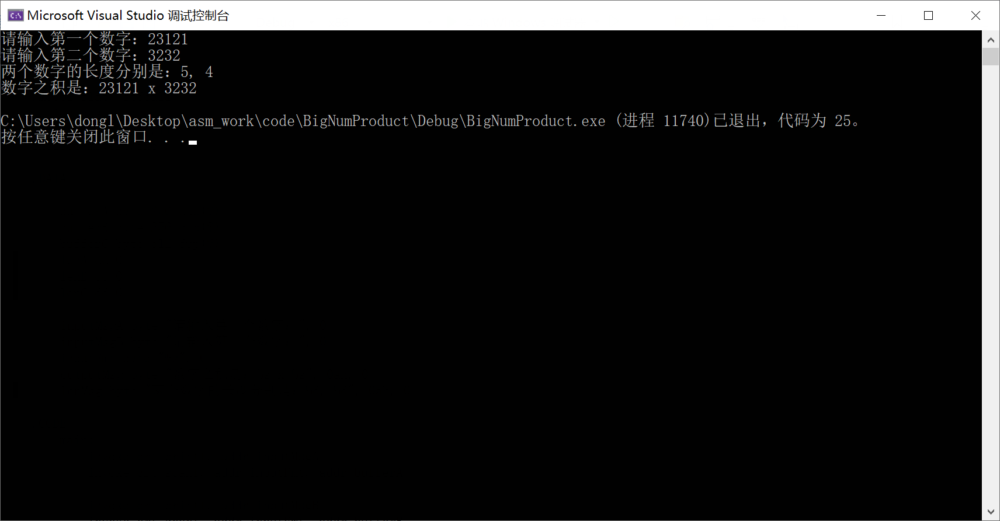

统计字符串长度

```asm
.386
.model flat, stdcall
option casemap:none
includelib msvcrt.lib
include msvcrt.inc

.DATA

    bufferA byte 256 dup(?)
    bufferB byte 256 dup(?)
    bufferC byte 512 dup(?)
    lenA dd 0
    lenB dd 0
    lenC dd 0
    
    inputMsgA byte "请输入第一个数字：", 0
    inputMsgB byte "请输入第二个数字：", 0
    inputFmt byte "%s", 0
    outputMsg byte "数字之积是：%s x %s", 0ah, 0
    lenMsg byte "两个数字的长度分别是：%d, %d", 0ah, 0

.CODE
    main:
        invoke crt_printf, addr inputMsgA
        invoke crt_scanf, addr inputFmt, addr bufferA

        invoke crt_printf, addr inputMsgB
        invoke crt_scanf, addr inputFmt, addr bufferB

        ; 计算字符串长度
        invoke crt_strlen, addr bufferA
        mov lenA, eax

        invoke crt_strlen, addr bufferB
        mov lenB, eax

        invoke crt_printf, addr lenMsg, lenA, lenB
        invoke crt_printf, addr outputMsg, addr bufferA, addr bufferB

        ret
    end main
```

