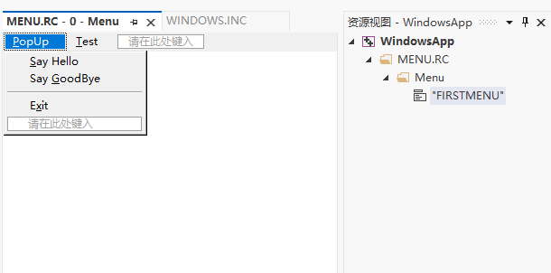

# Tutorial 8: Menu

> 这一章引入了一些新的概念，决定整体的细读一下这个教程

## Theory

菜单是窗口中最重要的组件之一。菜单呈现了程序向用户提供的服务列表。用户无需阅读程序附带的手册就能使用它，他可以浏览菜单以了解特定程序的功能概述，并立即开始使用。由于菜单是帮助用户快速上手的工具，应该遵循标准。简而言之，菜单的前两个项目应该是“文件”和“编辑”，最后一个应该是“帮助”。您可以在“编辑”和“帮助”之间插入自己的菜单项。如果菜单项调用对话框，应在菜单字符串后附加省略号 (...)。

菜单是一种资源。资源有几种类型，如对话框、字符串表、图标、位图、菜单等。资源在一个称为资源文件的独立文件中进行描述，通常具有 .rc 扩展名。然后，在链接阶段将资源与源代码组合在一起。最终的产品是一个包含指令和资源的可执行文件。

您可以使用任何文本编辑器编写资源脚本。它们由描述特定程序中使用的资源的外观和其他属性的短语组成。虽然您可以使用文本编辑器编写资源脚本，但这相对繁琐。更好的选择是使用资源编辑器，它让您可以轻松地以可视化方式设计资源。资源编辑器通常包含在编译器套件中，如Visual C++、Borland C++等。

您可以这样描述菜单资源：

```rc
MyMenu  MENU
{
   [menu list here]
}
```

----------

> 译者注：这里的效果在Visual Studio中会更加的好看，而不简单的一个资源文件：

比如`Files 1\WINDOWS.INC`的代码

```rc
#define IDM_TEST 1
#define IDM_HELLO 2
#define IDM_GOODBYE 3
#define IDM_EXIT 4

FirstMenu MENU
{
 POPUP "&PopUp"
        {
         MENUITEM "&Say Hello",IDM_HELLO
         MENUITEM "Say &GoodBye", IDM_GOODBYE
         MENUITEM SEPARATOR
         MENUITEM "E&xit",IDM_EXIT
        }
 MENUITEM "&Test", IDM_TEST
}
```

在VS2022中可以直接看到



----------

C程序员可能会注意到这与声明结构相似。`MyMenu` 是菜单名称，后面跟着 `MENU` 关键字和花括号内的菜单列表。或者，如果愿意，您也可以使用 `BEGIN` 和 `END` 而不是花括号。这种语法更适合 `Pascal` 程序员。

菜单列表可以是 `MENUITEM` 或 `POPUP` 语句。

`MENUITEM` 语句定义了一个在选择时不调用弹出菜单的菜单栏。语法如下：

```rc
MENUITEM "&text", ID [,options]
```

它以 `MENUITEM` 关键字开始，后面是您想用作菜单栏字符串的文本。请注意 "&" 符号，它使其后的字符带下划线。在文本字符串之后是菜单项的`ID`。`ID` 是一个数字，将在选择菜单项时发送给窗口过程以标识该菜单项的消息中使用。因此，每个菜单`ID`在它们之间必须是唯一的。

选项是可选的。可用选项如下：

- `GRAYED`  - 菜单项处于非活动状态，不会生成 `WM_COMMAND` 消息。文本显示为灰色。
- `INACTIVE` - 菜单项处于非活动状态，不会生成 `WM_COMMAND` 消息。文本以正常方式显示。
- `MENUBREAK` - 此项及其后续项将显示在菜单的新行上。
- `HELP` - 此项及其后续项将右对齐显示。

您可以使用上述选项之一，或与 "or" 运算符结合使用。请注意，`INACTIVE` 和 `GRAYED` 不能一起组合使用。

`POPUP` 语句的语法如下：

```rc
POPUP "&text" [,options]
{
  [menu list]
}
```

`POPUP` 语句定义了一个菜单栏，当选择时，会在一个小的弹出窗口中显示菜单项列表。菜单列表可以是 `MENUITEM` 或 `POPUP` 语句。还有一种特殊类型的 `MENUITEM` 语句，即 MENUITEM SEPARATOR，它会在弹出窗口中绘制一条水平线。

完成菜单资源脚本后的下一步是在程序中引用它。您可以在程序的两个不同位置进行这样的引用。

- 在 `WNDCLASSEX` 结构的 `lpszMenuName` 成员中。例如，如果您有一个名为 "FirstMenu" 的菜单，您可以将菜单分配给窗口如下：

```asm
.DATA
    MenuName  db "FirstMenu",0
    ...........................
    ...........................
.CODE
    ...........................
    mov   wc.lpszMenuName, OFFSET MenuName
```

- 在 `CreateWindowEx` 函数的菜单句柄参数中，例如：

```asm
.DATA
    MenuName  db "FirstMenu",0
    hMenu HMENU ?
    ...........................
    ...........................
.CODE
    ...........................
    invoke LoadMenu, hInst, OFFSET MenuName
    mov   hMenu, eax
    invoke CreateWindowEx,NULL,OFFSET ClsName,\
                OFFSET Caption, WS_OVERLAPPEDWINDOW,\
                CW_USEDEFAULT,CW_USEDEFAULT,\
                CW_USEDEFAULT,CW_USEDEFAULT,\
                NULL,\
            hMenu,\
                hInst,\
                NULL\
    ...........................
```

因此，你可能会问，这两种方法有什么区别呢？

当你在 `WNDCLASSEX` 结构的 `lpszMenuName` 成员中引用菜单时，菜单成为窗口类的“默认”菜单。该类的每个窗口都将拥有相同的菜单。

如果您希望从同一类创建的每个窗口都具有不同的菜单，您必须选择第二种形式。在这种情况下，通过 `CreateWindowEx` 函数传递菜单句柄的任何窗口都将具有一个菜单，该菜单“覆盖”了在 `WNDCLASSEX` 结构中定义的默认菜单。

接下来，我们将研究菜单在用户选择菜单项时如何通知窗口过程。

当用户选择菜单项时，窗口过程将收到一个 `WM_COMMAND` 消息。`wParam` 的低位字包含所选菜单项的菜单ID。

现在我们有足够的信息来创建和使用菜单。让我们开始吧。

## Example

第一个[示例](Files 1\MENU.ASM)演示了如何通过在窗口类中指定菜单名称来创建和使用菜单。

```asm
.386
.model flat,stdcall
option casemap:none

WinMain proto :DWORD,:DWORD,:DWORD,:DWORD

include \masm32\include\windows.inc
include \masm32\include\user32.inc
include \masm32\include\kernel32.inc
includelib \masm32\lib\user32.lib
includelib \masm32\lib\kernel32.lib

.data
ClassName db "SimpleWinClass",0
AppName  db "Our First Window",0
MenuName db "FirstMenu",0                ; 菜单在资源文件中的名称。
Test_string db "You selected Test menu item",0
Hello_string db "Hello, my friend",0
Goodbye_string db "See you again, bye",0

.data?
hInstance HINSTANCE ?
CommandLine LPSTR ?

.const
IDM_TEST equ 1                    ; 菜单项的ID
IDM_HELLO equ 2
IDM_GOODBYE equ 3
IDM_EXIT equ 4

.code
start:
    invoke GetModuleHandle, NULL
    mov    hInstance,eax
    invoke GetCommandLine
    mov CommandLine,eax
    invoke WinMain, hInstance,NULL,CommandLine, SW_SHOWDEFAULT
    invoke ExitProcess,eax

WinMain proc hInst:HINSTANCE,hPrevInst:HINSTANCE,CmdLine:LPSTR,CmdShow:DWORD
    LOCAL wc:WNDCLASSEX
    LOCAL msg:MSG
    LOCAL hwnd:HWND
    mov   wc.cbSize,SIZEOF WNDCLASSEX
    mov   wc.style, CS_HREDRAW or CS_VREDRAW
    mov   wc.lpfnWndProc, OFFSET WndProc
    mov   wc.cbClsExtra,NULL
    mov   wc.cbWndExtra,NULL
    push  hInst
    pop   wc.hInstance
    mov   wc.hbrBackground,COLOR_WINDOW+1
    mov   wc.lpszMenuName,OFFSET MenuName        ; 在这里放入我们的菜单名
    mov   wc.lpszClassName,OFFSET ClassName
    invoke LoadIcon,NULL,IDI_APPLICATION
    mov   wc.hIcon,eax
    mov   wc.hIconSm,eax
    invoke LoadCursor,NULL,IDC_ARROW
    mov   wc.hCursor,eax
    invoke RegisterClassEx, addr wc
    invoke CreateWindowEx,NULL,ADDR ClassName,ADDR AppName,\
           WS_OVERLAPPEDWINDOW,CW_USEDEFAULT,\
           CW_USEDEFAULT,CW_USEDEFAULT,CW_USEDEFAULT,NULL,NULL,\
           hInst,NULL
    mov   hwnd,eax
    invoke ShowWindow, hwnd,SW_SHOWNORMAL
    invoke UpdateWindow, hwnd
    .WHILE TRUE
                invoke GetMessage, ADDR msg,NULL,0,0
                .BREAK .IF (!eax)
                invoke DispatchMessage, ADDR msg
    .ENDW
    mov     eax,msg.wParam
    ret
WinMain endp

WndProc proc hWnd:HWND, uMsg:UINT, wParam:WPARAM, lParam:LPARAM
    .IF uMsg==WM_DESTROY
        invoke PostQuitMessage,NULL
    .ELSEIF uMsg==WM_COMMAND
        mov eax,wParam
        .IF ax==IDM_TEST
            invoke MessageBox,NULL,ADDR Test_string,OFFSET AppName,MB_OK
        .ELSEIF ax==IDM_HELLO
            invoke MessageBox, NULL,ADDR Hello_string, OFFSET AppName,MB_OK
        .ELSEIF ax==IDM_GOODBYE
            invoke MessageBox,NULL,ADDR Goodbye_string, OFFSET AppName, MB_OK
        .ELSE
            invoke DestroyWindow,hWnd
        .ENDIF
    .ELSE
        invoke DefWindowProc,hWnd,uMsg,wParam,lParam
        ret
    .ENDIF
    xor    eax,eax
    ret
WndProc endp
end start
```

资源文件在[这里](Files 1\WINDOWS.INC)

## Analysis

让我们首先分析资源文件。

```rc
#define IDM_TEST 1                /* equal to IDM_TEST equ 1*/
#define IDM_HELLO 2
#define IDM_GOODBYE 3
#define IDM_EXIT 4
```

上述行定义了菜单脚本中使用的菜单ID。只要该值在菜单中是唯一的，您可以为ID分配任何值。

```rc
FirstMenu MENU
```

使用 MENU 关键字声明您的菜单。

```rc
{
 POPUP "&PopUp"
        {
         MENUITEM "&Say Hello",IDM_HELLO
         MENUITEM "Say &GoodBye", IDM_GOODBYE
         MENUITEM SEPARATOR
         MENUITEM "E&xit",IDM_EXIT
        }
 MENUITEM "&Test", IDM_TEST
}
```

使用四个菜单项定义一个弹出菜单，其中第三个是一个菜单分隔符。
在主菜单中定义一个菜单栏。
接下来，我们将检查源代码。

```asm
MenuName db "FirstMenu",0                ; The name of our menu in the resource file.
Test_string db "You selected Test menu item",0
Hello_string db "Hello, my friend",0
Goodbye_string db "See you again, bye",0
```

`MenuName` 是资源文件中菜单的名称。请注意，您可以在资源文件中定义多个菜单，因此必须指定要使用的菜单。其余的三行定义了在用户选择相应菜单项时调用的消息框中要显示的文本字符串。

```asm
IDM_TEST equ 1                    ; Menu IDs
IDM_HELLO equ 2
IDM_GOODBYE equ 3
IDM_EXIT equ 4
```

定义用于窗口过程的菜单ID。这些值必须与资源文件中定义的值相同。

```asm
.ELSEIF eax==WM_COMMAND
        mov eax,wParam
        .IF ax==IDM_TEST
                invoke MessageBox,NULL,ADDR Test_string,OFFSET AppName,MB_OK
        .ELSEIF ax==IDM_HELLO
                invoke MessageBox, NULL,ADDR Hello_string, OFFSET AppName,MB_OK
        .ELSEIF ax==IDM_GOODBYE
                invoke MessageBox,NULL,ADDR Goodbye_string, OFFSET AppName, MB_OK
        .ELSE
                invoke DestroyWindow,hWnd
        .ENDIF
```

在窗口过程中，我们处理 `WM_COMMAND` 消息。当用户选择菜单项时，菜单项的菜单ID与 `WM_COMMAND` 消息一起以 `wParam` 的低位字发送到窗口过程。因此，当我们将 `wParam` 的值存储在 `eax` 中时，我们将 ax 中的值与之前定义的菜单ID进行比较，并相应地执行操作。在前三种情况下，当用户选择“Test”、“Say Hello”和“Say GoodBye”菜单项时，我们只是在消息框中显示一个文本字符串。

如果用户选择“Exit”菜单项，我们调用 `DestroyWindow` 并将我们窗口的句柄作为参数，这将关闭我们的窗口。

正如您所看到的，指定窗口类中的菜单名称非常简单明了。但是，您还可以使用另一种方法在窗口中加载菜单。我不会在此展示完整的源代码。资源文件在两种方法中是相同的。源文件中有一些细微的更改，我将在下面展示。

```asm
.data?
hInstance HINSTANCE ?
CommandLine LPSTR ?
hMenu HMENU ?                    ; handle of our menu
```

定义一个类型为 HMENU 的变量来存储我们的菜单句柄。

```asm
invoke LoadMenu, hInst, OFFSET MenuName
mov    hMenu,eax
INVOKE CreateWindowEx,NULL,ADDR ClassName,ADDR AppName,\
    WS_OVERLAPPEDWINDOW,CW_USEDEFAULT,\
    CW_USEDEFAULT,CW_USEDEFAULT,CW_USEDEFAULT,NULL,hMenu,\
    hInst,NULL
```

在调用 CreateWindowEx 之前，我们调用 LoadMenu，其中包括实例句柄和指向我们菜单名称的指针。LoadMenu 返回资源文件中菜单的句柄，我们将其传递给 CreateWindowEx。